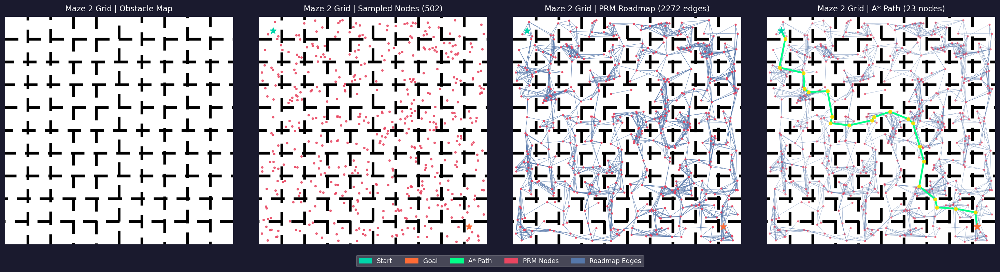

# Intelligent Path Planning in 2D Robotic Environments

[](https://www.python.org/)
[](LICENSE)

A sampling-based 2D robot path-planning project implementing Probabilistic Roadmap Method (PRM), KD-Tree roadmap construction, collision checking, A* search, path smoothing, benchmarking, and RRT comparison on binary obstacle maps.

---

## Overview

This project solves the classical motion-planning problem on 2D binary maps, where black pixels represent obstacles and white pixels represent free space. Given a start and goal coordinate, the planner constructs a collision-free roadmap in the free space and searches for a feasible path.

The main planner uses PRM to sample valid nodes, KD-Tree nearest-neighbor search to build the roadmap efficiently, and A* search to find a short path on the constructed graph. The repository also includes a Rapidly-exploring Random Tree (RRT) implementation for comparison, an interactive Streamlit demo, command-line scripts, benchmark reports, and automated tests.

---

## Features

| Component                | Description                                                     |
| ------------------------ | --------------------------------------------------------------- |
| PRM roadmap construction | Samples free-space nodes and builds an undirected roadmap       |
| KD-Tree neighbor search  | Connects each node to nearby candidates using SciPy KDTree      |
| Collision checking       | Validates roadmap edges at pixel-level resolution               |
| A* search                | Finds a short path on the PRM graph using Euclidean heuristic   |
| Obstacle clearance       | Inflates obstacles to account for robot radius or safety margin |
| Start-goal validation    | Rejects invalid, blocked, or unsafe coordinates before planning |
| Path smoothing           | Removes redundant waypoints using shortcut-based smoothing      |
| RRT comparison           | Compares PRM + A* with a goal-biased RRT planner                |
| Benchmarking             | Generates CSV reports for multiple map scenarios                |
| Streamlit app            | Provides an interactive browser-based demo                      |
| Unit tests               | Covers A*, collision checking, PRM, and map loading components  |

---

## Algorithm Pipeline

```text
Input binary map
    |
    v
Load and threshold map
    |
    v
Apply obstacle clearance
    |
    v
Sample collision-free PRM nodes
    |
    v
Build KD-Tree roadmap
    |
    v
Validate roadmap edges using collision checking
    |
    v
Run A* search from start to goal
    |
    v
Optionally smooth the final path
    |
    v
Save visualization and benchmark results
```

---

## Algorithm Details

### Probabilistic Roadmap Method

The PRM planner works in two phases.

In the roadmap construction phase, it samples points from free space and connects each point to its nearest neighbors. Every candidate edge is collision-checked before being added to the graph.

In the query phase, the start and goal points are inserted into the roadmap and A* search is used to find a path between them.

```text
1. Sample N free-space nodes.
2. Add start and goal nodes.
3. Use KD-Tree to find k-nearest neighbors for each node.
4. Add an undirected edge only if the segment is collision-free.
5. Run A* search on the roadmap.
6. Return the final path if one exists.
```

### KD-Tree Roadmap Construction

Naive nearest-neighbor search compares each node with every other node. This becomes expensive as the number of sampled nodes increases. This implementation uses `scipy.spatial.KDTree` to query nearby nodes efficiently.

### Collision Checking

Each candidate edge is sampled at approximately one-pixel resolution. If any sampled point lies outside the map or on an obstacle, the edge is rejected. This prevents roadmap edges from passing through walls or invalid regions.

### A* Search

A* is used on the PRM graph with Euclidean distance as the heuristic. Since the roadmap edges are weighted by Euclidean distance, A* prioritizes nodes that are both close to the start and promising toward the goal.

### RRT Comparison

RRT is included as a single-query sampling-based planner. It incrementally grows a tree from the start toward random samples, with a configurable goal bias. This gives a useful comparison between roadmap-based and tree-based planning.

---

## Repository Structure

```text
prm-astar-path-planning/
├── .github/
│   └── workflows/
│       └── ci.yml
├── assets/
│   ├── prm_maze_hard.png
│   ├── prm_grid_world.png
│   ├── prm_vs_rrt_maze_hard.png
│   └── prm_vs_rrt_grid_world.png
├── docs/
│   └── algorithm_explanation.md
├── examples/
│   ├── maze_1.png
│   ├── maze_2.png
│   └── maze_3.png
├── outputs/
│   ├── benchmark_results.csv
│   └── comparison_results.csv
├── scripts/
│   ├── benchmark.py
│   ├── compare_algorithms.py
│   ├── generate_maps.py
│   └── run_planner.py
├── src/
│   ├── __init__.py
│   ├── astar.py
│   ├── collision_checker.py
│   ├── map_loader.py
│   ├── prm.py
│   ├── rrt.py
│   ├── smoother.py
│   ├── utils.py
│   └── visualizer.py
├── tests/
│   ├── test_astar.py
│   ├── test_collision.py
│   ├── test_map_loader.py
│   └── test_prm.py
├── app.py
├── LICENSE
├── README.md
└── requirements.txt
```

---

## Installation

Clone the repository and install dependencies.

```bash
git clone https://github.com/YOUR_USERNAME/prm-astar-path-planning.git
cd prm-astar-path-planning
pip install -r requirements.txt
```

Recommended Python version:

```text
Python 3.10+
```

---

## Usage

### 1. Run the Streamlit Demo

```bash
streamlit run app.py
```

The web demo allows you to select built-in maps, upload custom maps, configure start and goal coordinates, choose between PRM + A* and RRT, and download the resulting path visualization.

---

### 2. Run the CLI Planner

```bash
python scripts/run_planner.py --map examples/maze_1.png --nodes 500 --neighbors 20 --start 5,235 --goal 350,450 --clearance 3 --seed 42 --smooth --no-show
```

Common arguments:

| Argument      | Description                                   |
| ------------- | --------------------------------------------- |
| `--map`       | Path to the binary map image                  |
| `--nodes`     | Number of PRM nodes to sample                 |
| `--neighbors` | Number of nearest neighbors per node          |
| `--start`     | Start coordinate as `row,col`                 |
| `--goal`      | Goal coordinate as `row,col`                  |
| `--clearance` | Obstacle clearance in pixels                  |
| `--seed`      | Random seed for reproducibility               |
| `--smooth`    | Enables shortcut-based path smoothing         |
| `--no-show`   | Saves output without opening a display window |

---

### 3. Run Benchmarks

```bash
python scripts/benchmark.py
```

This runs PRM + A* on fixed scenarios and saves results to:

```text
outputs/benchmark_results.csv
```

---

### 4. Compare PRM + A* with RRT

```bash
python scripts/compare_algorithms.py
```

This runs both planners on the same scenarios and saves results to:

```text
outputs/comparison_results.csv
```

It also generates local comparison figures in `outputs/`. These generated images are ignored by Git by default. Selected README images are stored in `assets/`.

---

### 5. Run Tests

```bash
python -m pytest tests/ -v
```

The test suite covers:

```text
A* search
Path length computation
Collision checking
PRM sampling
PRM roadmap construction
Map loading
Obstacle clearance
```

---

## Example Results

### PRM Path on Maze Scenario


### PRM Path on Grid World



### PRM + A* vs RRT


---

## Benchmark Results

The following results were generated with:

```text
nodes = 500
k-neighbors = 20
clearance = 3
seed = 42
```

| Scenario         | Nodes | Edges | A* Explored | Found | Path Length (px) |
| ---------------- | ----: | ----: | ----------: | ----: | ---------------: |
| Maze 1 Easy      |   502 |  3469 |          14 |   Yes |            221.0 |
| Maze 1 Hard      |   502 |  3444 |          51 |   Yes |            584.7 |
| Maze 2 Grid      |   502 |  2096 |         640 |   Yes |            866.7 |
| Maze 3 Obstacles |   502 |  4706 |         363 |   Yes |            708.5 |

The exact runtime can vary by machine, but the benchmark script records build time, search time, total time, and path statistics in `outputs/benchmark_results.csv`.

---

## PRM + A* vs RRT Comparison

The comparison script runs PRM + A* once and RRT across multiple seeded runs for each scenario.

| Scenario         | Algorithm | Success Rate | Avg Path Length (px) | Avg Time (ms) |
| ---------------- | --------- | -----------: | -------------------: | ------------: |
| Maze 1 Hard      | PRM + A*  |         100% |                592.1 |         522.1 |
| Maze 1 Hard      | RRT       |         100% |                798.1 |         572.0 |
| Maze 2 Grid      | PRM + A*  |         100% |                816.0 |         543.5 |
| Maze 2 Grid      | RRT       |         100% |                895.2 |         777.1 |
| Maze 3 Obstacles | PRM + A*  |         100% |                637.8 |         619.4 |
| Maze 3 Obstacles | RRT       |         100% |                879.9 |          88.4 |

Observed behavior:

```text
PRM + A* generally produced shorter paths on the tested maps.
RRT was faster in the open random-obstacle map because it reached the goal region quickly.
PRM is more useful when the same roadmap can be reused for multiple queries.
```

---

## Design Choices

### Why PRM?

PRM is suitable for multi-query path planning. Once a roadmap has been built, different start-goal queries can reuse the same graph structure.

### Why A*?

A* provides efficient graph search when a useful heuristic is available. Here, Euclidean distance is a natural heuristic for 2D path planning.

### Why RRT?

RRT provides a useful contrast because it is a single-query planner. It can be faster in open spaces but may return longer paths without post-processing or rewiring.

### Why Obstacle Clearance?

A robot is not a point mass. Clearance allows the planner to avoid paths that pass too close to obstacles.

---

## Tech Stack

| Tool           | Purpose                              |
| -------------- | ------------------------------------ |
| Python         | Core implementation                  |
| NumPy          | Array operations and sampling        |
| OpenCV         | Image loading and obstacle clearance |
| SciPy          | KD-Tree nearest-neighbor queries     |
| Matplotlib     | Static path visualizations           |
| Streamlit      | Interactive demo                     |
| pytest         | Automated testing                    |
| GitHub Actions | Continuous integration               |

---

## Future Improvements

* Add PRM* for asymptotically optimal roadmap planning.
* Add RRT* for rewiring-based tree optimization.
* Support weighted terrain costs instead of only binary obstacle maps.
* Add multi-query mode with cached roadmaps.
* Extend the planner to 3D occupancy-grid environments.
* Add interactive point selection in the Streamlit app.

---

## Author

Ayush Goel
B.Tech, Indian Institute of Technology Kharagpur

---

## License

This project is released under the MIT License. See `LICENSE` for details.
