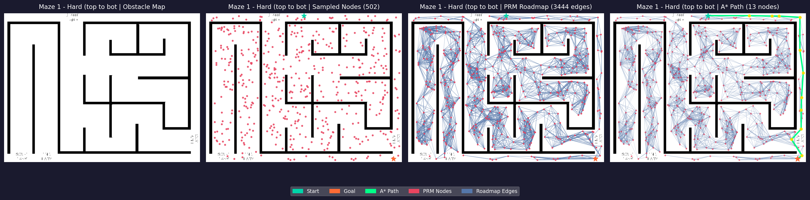
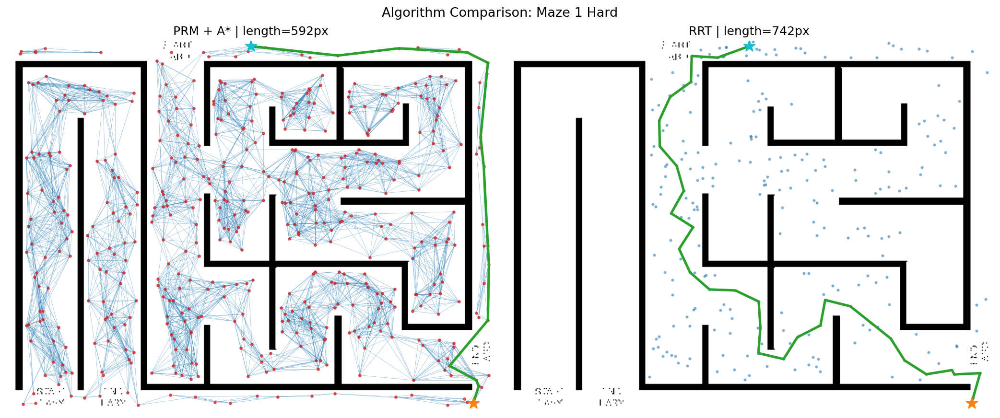

# PRM + A* Path Planning on 2D Occupancy Maps

A 2D motion-planning system built with **Probabilistic Roadmaps (PRM), KDTree nearest-neighbor search, A*, collision checking, and RRT benchmarking** on binary occupancy maps.

The project focuses on algorithmic correctness, reproducibility, testing, and measurable planner behavior through a CLI, Streamlit interface, automated benchmarks, and CI.

**Tech:** Python · NumPy · SciPy · OpenCV · Matplotlib · Streamlit · pytest · GitHub Actions

---

## Highlights

* Built an end-to-end **PRM + KDTree + A*** planning pipeline for static 2D occupancy maps.
* Constructed roadmaps from **500 sampled configurations + start/goal anchors**, producing **2,233–5,312 collision-validated edges** across deterministic benchmarks.
* Implemented Euclidean A* search with stale-entry handling, requiring **8–355 unique node expansions** and **1.5–19.6 ms query time** across four benchmark scenarios.
* Added conservative raster collision checking, obstacle clearance, start/goal validation, and collision-safe shortcut smoothing.
* Implemented a seeded **goal-biased RRT** baseline and evaluated both planners across **60 matched-seed planning attempts**.
* Developed **73 automated tests** covering algorithms, edge cases, benchmark methodology, and the complete planning pipeline.
* Added reproducible CLI and Streamlit workflows with pytest CI on Python 3.10 and 3.11.

---

## Example Results

### PRM + A* Planning Pipeline

<p align="center">
  
</p>

<p align="center">
  <i>PRM roadmap construction and collision-free A* path on the benchmark occupancy map.</i>
</p>

<br>

### PRM + A* vs Goal-Biased RRT

<p align="center">
  
</p>

<p align="center">
  <i>Visual comparison of PRM + A* and goal-biased RRT on the same planning scenario.</i>
</p>

---

## Planning Pipeline

```text
Occupancy map
     |
     v
Binary map preprocessing
     |
     v
Obstacle clearance
     |
     v
Start / goal validation
     |
     v
Free-space sampling
     |
     v
KDTree neighbor lookup
     |
     v
Collision-checked PRM roadmap
     |
     v
A* graph search
     |
     v
Optional shortcut smoothing
     |
     v
Collision-free path
```

---

## Core Components

### Probabilistic Roadmap

The planner samples valid free-space configurations and connects nearby nodes to construct an undirected roadmap.

Start and goal are inserted separately as anchor vertices and receive a wider neighbor-candidate search to improve their chance of connecting to the roadmap. Every proposed connection still passes the same collision checker.

Sampling is seeded for reproducibility.

### KDTree Neighbor Search

`scipy.spatial.KDTree` is used to efficiently retrieve nearby candidate nodes instead of performing an explicit all-pairs neighbor search.

The KDTree only proposes candidates; edge validity is determined separately through collision checking.

### A* Search

A* searches the PRM roadmap using:

* Euclidean edge weights
* Euclidean distance as the heuristic
* stale priority-queue entry filtering
* unique expanded-node accounting

A* returns a shortest path **on the constructed roadmap**. The resulting path is not necessarily the globally shortest path in continuous free space.

### Collision Checking

Roadmap and RRT edges use a conservative raster traversal that checks grid cells touched by the segment.

This prevents thin obstacles from being skipped and supports both integer PRM configurations and floating-point RRT nodes.

### Obstacle Clearance

Obstacle clearance is implemented by shrinking free space using a square morphological kernel.

This provides a conservative pixel-grid safety margin around obstacles.

### Path Smoothing

PRM paths can optionally be simplified using shortcut smoothing.

Intermediate waypoints are removed only when the direct replacement segment remains collision-free.

### RRT Baseline

A seeded, goal-biased Rapidly-exploring Random Tree is included as a comparison planner.

The benchmark compares PRM + A* and RRT using matched random seeds and identical planning scenarios.

---

## Benchmark Highlights

The deterministic PRM benchmark uses:

```text
Samples:     500
Neighbors:   20
Clearance:   3 px
Seed:        42
Graph nodes: 502 including start and goal
```

Across four benchmark scenarios:

| Metric                 |  Observed Range |
| ---------------------- | --------------: |
| Accepted roadmap edges | **2,233–5,312** |
| A* expanded nodes      |       **8–355** |
| A* search time         | **1.5–19.6 ms** |

Complete build/search timings and path statistics are available in:

[`outputs/benchmark_results.csv`](outputs/benchmark_results.csv)

Runtime measurements are machine-specific.

---

## PRM vs RRT Evaluation

PRM + A* and goal-biased RRT were evaluated across:

**3 scenarios × 10 seeds × 2 planners = 60 planning attempts**

The comparison measures:

* success rate
* runtime
* successful-path length
* PRM roadmap size
* RRT tree size

Both algorithms use the same seed set for every scenario.

The experiments showed different planner trade-offs: PRM generated shorter successful paths across the tested scenarios, while the RRT baseline had lower single-query runtime in this implementation.

Full results, including unsuccessful attempts, are available in:

[`outputs/comparison_results.csv`](outputs/comparison_results.csv)

The measurements describe this implementation and benchmark configuration rather than universal PRM/RRT performance.

---

## Testing

Run the complete test suite with:

```bash
python -m pytest tests/ -v
```

Current suite:

**73 tests passing**

Coverage includes:

* map binarization
* obstacle clearance
* start/goal validation
* raster collision checking
* PRM sampling
* roadmap construction
* A* shortest-path behavior
* stale A* queue entries
* RRT planning
* path smoothing
* benchmark aggregation
* end-to-end PRM → A* planning

GitHub Actions runs the test suite on Python 3.10 and 3.11.

---

## Installation

```bash
git clone https://github.com/ayushgoel001/prm-astar-path-planning.git
cd prm-astar-path-planning
pip install -r requirements.txt
```

Python 3.10+ is recommended.

---

## Usage

### Command Line

```bash
python scripts/run_planner.py \
  --map examples/maze_1.png \
  --nodes 500 \
  --neighbors 20 \
  --start 5,235 \
  --goal 350,450 \
  --clearance 3 \
  --seed 42 \
  --smooth \
  --no-show
```

Coordinates use:

```text
(row, column)
```

`--nodes` specifies sampled PRM configurations. Start and goal are added separately to the roadmap.

### Streamlit Demo

```bash
streamlit run app.py
```

The interface supports:

* built-in or uploaded maps
* PRM + A* or RRT planning
* configurable start and goal
* obstacle clearance
* random seed control
* PRM smoothing
* result visualization and download

### Benchmarks

```bash
python scripts/benchmark.py
python scripts/compare_algorithms.py
```

---

## Repository Structure

```text
prm-astar-path-planning/
│
├── app.py                         # Streamlit application
├── src/
│   ├── astar.py                   # A* roadmap search
│   ├── collision_checker.py       # Raster collision checking
│   ├── map_loader.py              # Map preprocessing and clearance
│   ├── prm.py                     # PRM sampling and roadmap construction
│   ├── rrt.py                     # RRT comparison planner
│   ├── smoother.py                # Shortcut path smoothing
│   ├── utils.py
│   └── visualizer.py
│
├── scripts/
│   ├── run_planner.py             # CLI planner
│   ├── benchmark.py               # Deterministic PRM benchmark
│   ├── compare_algorithms.py      # Matched-seed PRM/RRT comparison
│   └── generate_maps.py
│
├── tests/                         # Unit, regression and integration tests
├── examples/                      # Example occupancy maps
├── outputs/                       # Benchmark CSV results
├── assets/                        # Selected result visualizations
├── docs/
│   └── algorithm_explanation.md
│
└── .github/workflows/ci.yml
```

---

## Algorithm Notes

This implementation uses **classical PRM**, not PRM*.

Finite-sample roadmaps may remain disconnected, particularly in constrained environments. Under standard assumptions, PRM is probabilistically complete as the sample count increases, but classical PRM does not provide continuous-space optimality guarantees.

For a more detailed discussion of PRM, KDTree lookup, A*, collision checking, RRT, complexity, and planner limitations, see:

[`docs/algorithm_explanation.md`](docs/algorithm_explanation.md)

---

## Limitations

* Static 2D binary occupancy maps only.
* Straight-line local connections without robot dynamics.
* Conservative raster clearance rather than exact robot geometry.
* Finite PRM roadmaps may remain disconnected in difficult environments.
* Roadmaps are currently rebuilt for each CLI/app query.

---

## License

Released under the [MIT License](LICENSE).
